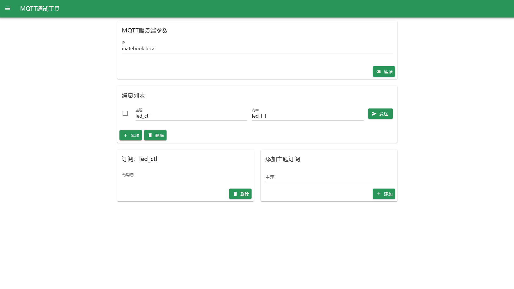

# MQTT
Web端MQTT调试工具，支持移动端调试

目前仅支持简单的消息订阅通知，欢迎提供后续开放建议

## 亮点
支持移动端调试
现代化的界面

## 使用方法

1. 运行 .exe 文件
2. 用浏览器打开 http://localhost:5000
3. 连接MQTT服务器

## 预览图

## 项目引用

MASA.Blazor: https://github.com/masastack/MASA.Blazor

MQTTnet: https://github.com/dotnet/MQTTnet

## 版权许可

[License MIT](/LittleFish-233/MQTT/blob/master/LICENSE.txt)